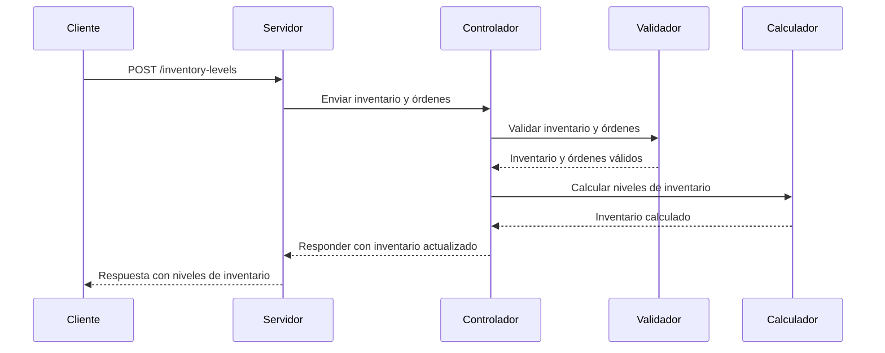

# Inventario y Órdenes - API

## Descripción

Este proyecto es una API que permite calcular los niveles de inventario en base a las órdenes recibidas. A través de una petición POST, el sistema procesa los datos de inventario y órdenes, y devuelve los niveles de stock, bloqueos, reservaciones, y faltantes para cada SKU.

### Funcionalidades

- **Cálculo de niveles de inventario**: Se calculan las cantidades disponibles, reservadas, y faltantes para cada producto (SKU) en función del inventario y de las órdenes recibidas.
- **Validación de inventario y órdenes**: Se valida que el inventario y las órdenes sean correctas antes de realizar cualquier procesamiento.

---

## Estructura del Proyecto

### Archivos Principales

1. **index.ts**  
   Es el archivo de inicio que levanta el servidor en el puerto 3000.

2. **app.ts**  
   Configura la aplicación de Express, habilitando la gestión de peticiones JSON y las rutas.

3. **routes/index.ts**  
   Define la ruta para la API, que maneja las peticiones POST a `/inventory-levels`.

4. **controllers/getInventoryLevels.ts**  
   Este controlador recibe la petición, valida el inventario y las órdenes, y llama a la función que calcula los niveles de inventario. Si todo es correcto, devuelve los datos.

5. **utils/validateObj.ts**  
   Contiene funciones para validar la estructura de los objetos de inventario y órdenes. Verifica que los campos necesarios estén presentes y que sus tipos sean correctos.

6. **utils/calculateInventoryLevel.ts**  
   El archivo clave donde se procesan los niveles de inventario:
   - Se inicializa un mapa con los productos y su inventario actual.
   - Se procesan las órdenes, ajustando los valores de cada SKU según las cantidades solicitadas.
   - Finalmente, devuelve los niveles de inventario actualizados (disponibles, reservados, bloqueados y faltantes).

7. **types.ts**  
   Define las interfaces y tipos utilizados en la aplicación para garantizar el tipado correcto en TypeScript.

---

## Flujo de la Aplicación

1. **Recepción de datos**: La API recibe los datos de inventario y órdenes a través de una petición POST.
2. **Validación**: El sistema valida que el inventario y las órdenes estén en el formato correcto.
3. **Cálculo de niveles de inventario**: La lógica de negocio calcula los niveles de stock basado en el inventario disponible y las órdenes recibidas.
4. **Respuesta**: Se devuelve un objeto con el inventario actualizado.

---

## Diagrama Secuencial

El siguiente diagrama en Mermaid ilustra el flujo de la aplicación:



---

## Ejemplo de Petición

```json
{
  "inventory": [
    {
      "sku": "P001",
      "stock": {
        "count": "100",
        "blocked": 10
      }
    },
    {
      "sku": "P002",
      "stock": {
        "count": "150",
        "blocked": 15
      }
    }
  ],
  "orders": [
    {
      "id": "O001",
      "order_lines": [
        {
          "sku": "P001",
          "quantity": 50
        }
      ]
    }
  ]
}
```

## Ejemplo de Respuesta

```json
{
  "inventoryLevels": [
    {
      "sku": "P001",
      "count": 100,
      "blocked": 10,
      "booked": 50,
      "missing": 0,
      "available": 40
    },
    {
      "sku": "P002",
      "count": 150,
      "blocked": 15,
      "booked": 0,
      "missing": 0,
      "available": 135
    }
  ]
}
```

---

## Ejecución del Proyecto

1. Clona este repositorio.
2. Instala las dependencias con `npm install`.
3. Ejecuta el servidor con `npm start`.
4. Envía una petición POST a `http://localhost:3000/inventory-levels` con un objeto de inventario y órdenes en el cuerpo de la petición.

---

## Tecnologías Utilizadas

- **TypeScript** para tipado estático.
- **Express** como framework para el manejo de las peticiones HTTP.
- **Mermaid** para la visualización de diagramas secuenciales.

---

## Autor

- Leopoldo Martínez

---